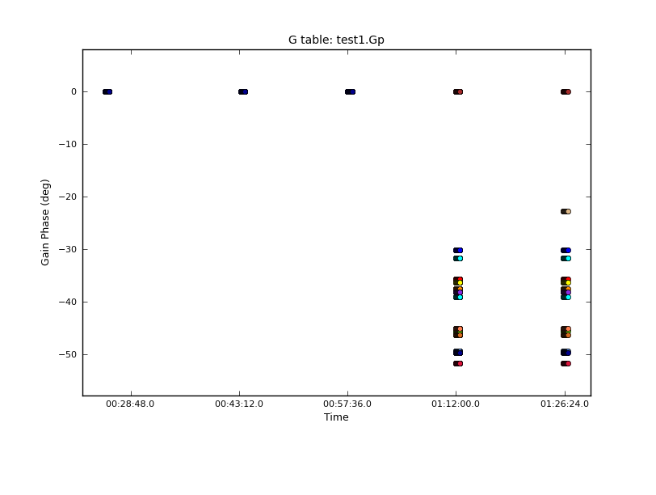
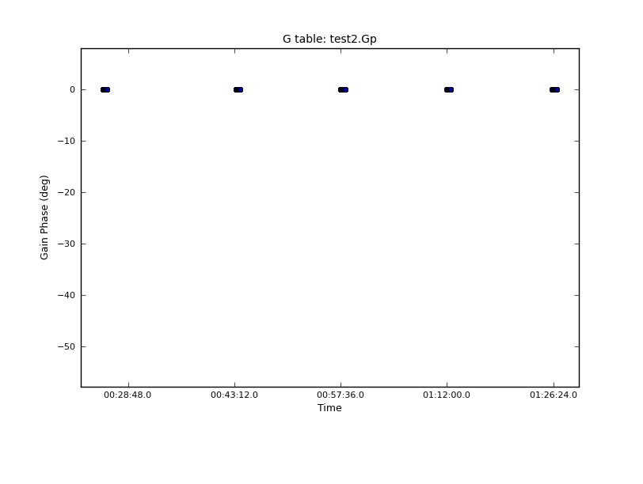

antintflag
=======

[CASA](http://casa.nrao.edu/) task to flag integrations if a specified antenna is flagged.

Latest version: 1.0 ([download here](https://github.com/chrishales/antintflag/releases/v1.0))

Tested with: CASA Version 4.7.0

antintflag is released under a BSD 3-Clause License (open source, commercially useable); refer to LICENSE for details.

Feedback regarding antintflag is always welcome.

The panels below show per-integration phase solutions on the reference antenna for a single polarization and 16 spectral windows. The left panel shows the gaincal solutions from the original data, while the right panel shows the gaincal solutions after application of antintflag.

 

The phase scrambling seen in the left panel is the result of the reference antenna being unavailable in the first few integrations of the 4<sup>th</sup> scan. A new reference antenna is selected, which is then tracked for the remaining integrations. The reason that the phases for the different spectral windows don't all shift to a consistent new non-zero value is because only a small number of baselines were available for the first integration. As a result, the solutions are noisy, scattering the recovered phases.

Installation
======

Download the latest version of the source files from [here](https://github.com/chrishales/antintflag/releases/latest).

Place the source files into a directory containing your measurement set. Without changing directories, open CASA and type
```
os.system('buildmytasks')
```
then exit CASA. A number of files should have been produced, including ```mytasks.py```. Reopen CASA and type
```
execfile('mytasks.py')
```
To see the parameter listing, type
```
inp antintflag
```
For more details on how antintflag works, type
```
help antintflag
```
Now set some parameters and press go!

For a more permanent installation, place the source files into a dedicated antintflag code directory and perform the steps above. Then go to the hidden directory ```.casa``` which resides in your home directory and create a file called ```init.py```. In this file, put the line
```
execfile('/<path_to_antintflag_directory>/mytasks.py')
```
antintflag will now be available when you open a fresh terminal and start CASA within any directory.

Acknowledging use of antintflag
======

antintflag is provided in the hope that it (or elements of its code) will be useful for your work. If you find that it is, I would appreciate your acknowledgement by citing [](https://doi.org/10.5281/zenodo.163002) as follows (note the [AAS guidelines for citing software](http://journals.aas.org/policy/software.html)):
```
Hales, C. A. 2016, antintflag, v1.0, doi:10.5281/zenodo.163002, as developed on GitHub
```
